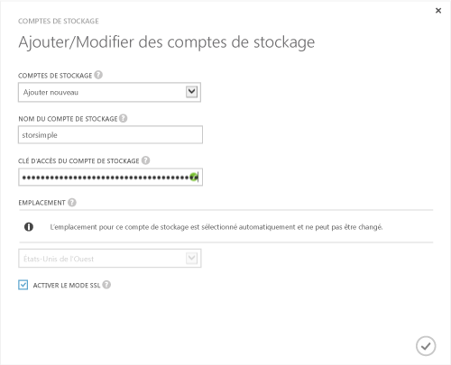

<properties 
   pageTitle="Facultatif : configuration d’un nouveau compte de stockage pour le service"
   description="Explique comment configurer un compte de stockage pour le service StorSimple."
   services="storsimple"
   documentationCenter="NA"
   authors="SharS"
   manager="adinah"
   editor="tysonn" /> <tags 
   ms.service="storsimple"
   ms.devlang="NA"
   ms.topic="article"
   ms.tgt_pltfrm="NA"
   ms.workload="TBD"
   ms.date="04/01/2015"
   ms.author="v-sharos" />

### Configuration d’un nouveau compte de stockage

1. Sur la page d’accueil du service StorSimple Manager, sélectionnez votre service et double-cliquez dessus. La page **Démarrage rapide** s’affiche. Sélectionnez la page **Configurer**.

2. Cliquez sur **Ajouter/modifier un compte de stockage**.

3. Dans la boîte de dialogue **Ajouter/modifier un compte de stockage**, procédez comme suit :

  1. Cliquez sur **Ajouter nouveau**.
  2. Entrez un nom pour votre compte de stockage.
  3. Indiquez la **Clé d’accès** principale pour votre compte de stockage Microsoft Azure.
  4. Sélectionnez **Activer le mode SSL** afin de créer un canal sécurisé pour la communication réseau entre votre appareil et le cloud. Décochez la case **Activer le mode SSL** uniquement si vous utilisez l’appareil dans un cloud privé.
  5. Cliquez sur l’icône en forme de coche . Un message s’affiche pour vous informer une fois le compte de stockage correctement créé.

    

4. Le compte de stockage qui vient d’être créé est affiché dans la page **Configurer**, sous **Comptes de stockage**. Cliquez sur **Enregistrer** pour enregistrer le nouveau compte de stockage. Cliquez sur **OK** lorsque vous êtes invité à confirmer l’opération.

<!--HONumber=52-->
