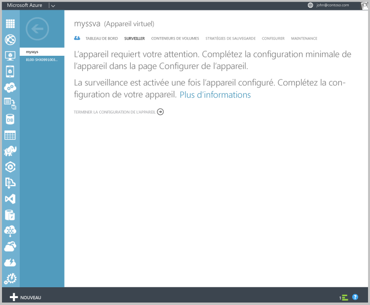
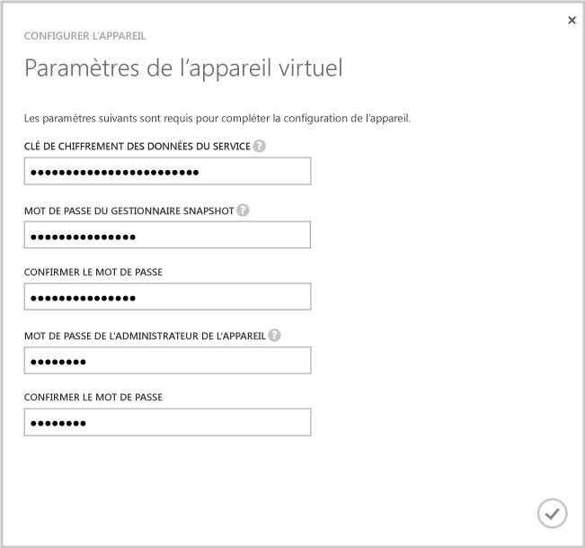
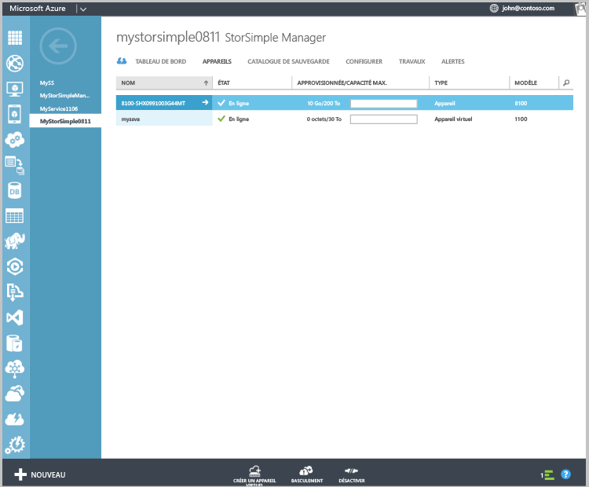

#### Pour configurer et enregistrer l’appareil virtuel

1. Sélectionnez l’appareil virtuel StorSimple que vous venez de créer dans la page **Appareils** .
2. Cliquez sur **Terminer la configuration de l’appareil**. L’Assistant Configurer l’appareil démarre.
    
    

4. Entrez la **clé de chiffrement des données de service** dans l’espace fourni.

5. Entrez les mots de passe d’administrateur de l’appareil et du Gestionnaire d'instantanés conformes à la longueur et aux paramètres spécifiés.

6. Cliquez sur la coche pour terminer la configuration initiale et l’inscription de l’appareil virtuel. 
    
    

Une fois la configuration et l'inscription terminées, l’appareil est mis en ligne. (La mise en ligne de l’appareil peut prendre plusieurs minutes.)

