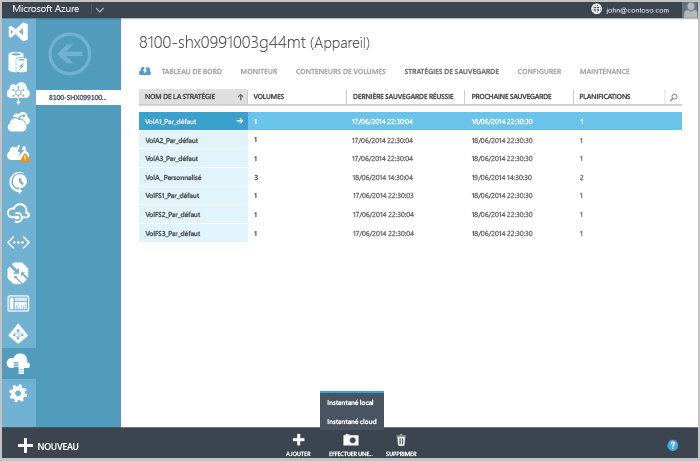
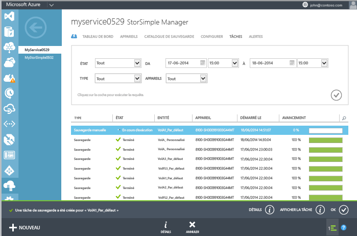

<!--author=SharS last changed: 9/15/15-->

#### Création d’une sauvegarde manuelle

1. Sur la page **Appareils**, accédez à l’onglet **Stratégies de sauvegarde**. Cet onglet répertorie toutes les stratégies de sauvegarde au format tabulaire, y compris la stratégie du volume que vous souhaitez sauvegarder.

2. Sélectionnez la stratégie en cliquant n’importe où dans la ligne correspondante, à l’exception de la première colonne. En bas de la page, cliquez sur **Sélectionner la sauvegarde**. Le bouton se développe pour afficher les options de sauvegarde : instantané local et instantané cloud.

3. Lorsque vous choisissez l’une de ces options, le système vous demande de confirmer votre choix. Cliquez sur **Oui**.

    
 
    Cette action lance un travail pour la création d’un instantané. Vous verrez une notification au bas de la page lorsque le travail aura été créé avec succès.

4. Pour surveiller le travail, cliquez sur **Afficher le travail** dans la zone de notification (en bas de la page).

    

5. Une fois le travail de sauvegarde terminé, accédez à l’onglet **Catalogue de sauvegarde**.

6. Définissez les sélections de filtre pour l’appareil approprié, la stratégie de sauvegarde et la plage horaire. Cliquez sur l’icône en forme de coche  après avoir défini les filtres.

  La sauvegarde doit apparaître dans la liste des jeux de sauvegarde qui s’affiche dans le catalogue.

<!---HONumber=Oct15_HO3-->