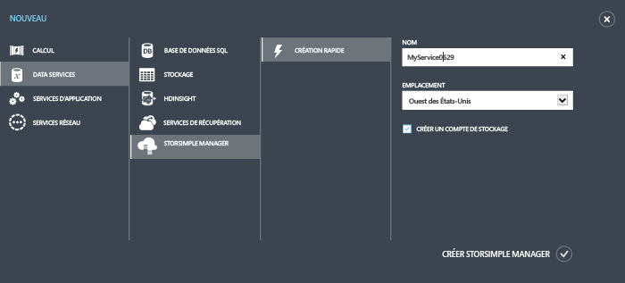
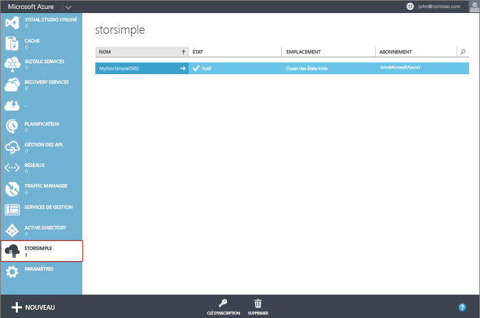

<!--author=alkohli last changed: 9/17/15-->

#### Création d’un service

1. À l’aide des informations d’identification de votre compte Microsoft, connectez-vous au portail de gestion à cette URL : [http://azure.microsoft.com/](http://azure.microsoft.com/).

2. Dans le portail de gestion, cliquez sur **Nouveau** > **Data Services** > **StorSimple Manager** > **Création rapide**.

3. Dans le formulaire qui s’affiche, procédez comme suit :
  1. Indiquez un **nom** unique pour votre service. Il s’agit d’un nom convivial qui peut être utilisé pour identifier le service. Le nom peut comporter entre 2 et 50 caractères qui peuvent être des lettres, des chiffres et des traits d’union. Il doit commencer et se terminer par une lettre ou un chiffre.
  2. Indiquez un **emplacement** pour votre service. De manière générale, choisissez un emplacement plus proche de la région géographique dans laquelle vous souhaitez déployer votre appareil. Vous pouvez également prendre en compte les éléments suivants : 
	 
		- Si vous avez des charges de travail existantes dans Azure que vous souhaitez également déployer avec votre périphérique StorSimple, nous vous invitons à utiliser ce centre de données.
		- Votre service du gestionnaire StorSimple et le stockage Azure peuvent se trouver en deux emplacements différents. Dans ce cas, vous devez créer séparément le gestionnaire StorSimple et le compte de stockage Azure. Pour créer un compte de stockage Azure, accédez au service Azure Storage dans le Portail de gestion et suivez les étapes dans [Création d'un compte de stockage Azure](storage-create-storage-account.md#create-a-storage-account). Une fois que vous avez créé ce compte, ajoutez-le au service du gestionnaire StorSimple en suivant les étapes dans [Configuration d'un nouveau compte de stockage pour le service](storsimple-deployment-walkthrough.md#configure-a-new-storage-account-for-the-service).
		 
  3. Choisissez un **abonnement** dans la liste déroulante. L’abonnement est lié à votre compte de facturation. Ce champ n’est pas présent si vous n’avez qu’un seul abonnement.
  4. Sélectionnez **Créer un nouveau compte de stockage** pour créer automatiquement un compte de stockage avec le service. Ce compte de stockage possédera un nom spécial, tel que « storsimplebwv8c6dcnf ». Si vous avez besoin de vos données dans un autre emplacement, désactivez cette case à cocher. 
  5. Cliquez sur **Créer StorSimple Manager** pour créer le service.

   

  Vous allez être redirigé vers la page d’accueil **Service**. La création de service dure quelques minutes. Une fois le service créé, vous recevez la notification correspondante et l’état du service devient **Actif**.
 
   

 **Vidéo disponible**

Pour visionner une vidéo qui montre comment créer un service StorSimple Manager, cliquez [ici](http://azure.microsoft.com/documentation/videos/create-a-storsimple-manager-service/).

<!---HONumber=Oct15_HO3-->