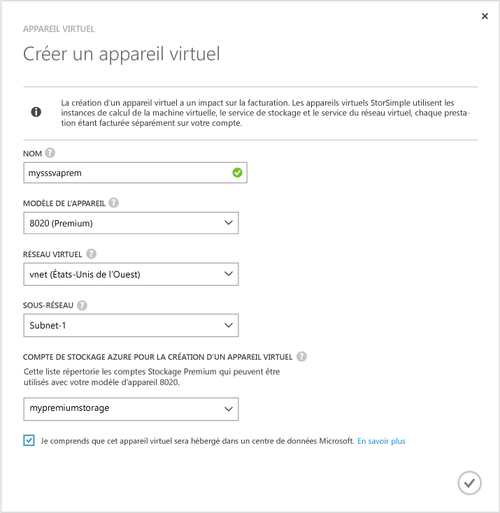
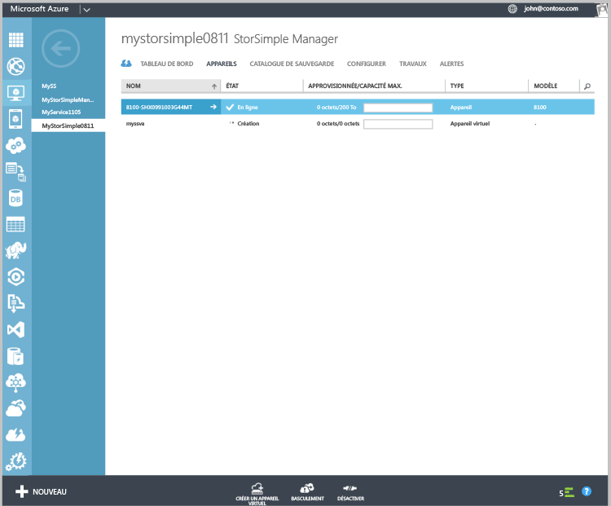

#### Création d'un appareil virtuel
1. Dans le portail Azure, accédez au service **StorSimple Manager** .
2. Accédez à la page **Appareils** . Cliquez sur **Créer un appareil virtuel** en bas de la page **Appareils**.
3. Dans la boîte de dialogue **Créer un appareil virtuel**, spécifiez les éléments suivants.
   
    
   
   1. **Nom** : nom unique de votre appareil virtuel.
   2. **Modèle** : sélectionnez le modèle de l'appareil virtuel. Ce champ n'apparaît que si vous exécutez Update 2 ou une version ultérieure. Un modèle d'appareil 8010 offre 30 To de stockage standard tandis qu'un modèle d'appareil 8020 offre 64 To de stockage Premium. Spécifiez 8010
   3. pour déployer des scénarios de récupération au niveau de l'élément à partir de sauvegardes. Sélectionnez 8020 pour déployer des charges de travail aux performances élevées et faible latence ou pour une utilisation comme appareil secondaire pour la récupération d'urgence.
   4. **Version** : sélectionnez la version de l’appareil virtuel. Si un modèle d'appareil 8020 est sélectionné, le champ de la version ne s'affiche pas. Cette option est absente si tous les appareils physiques enregistrés auprès de ce service exécutent Update 1 (ou ultérieure). Ce champ n'apparaît que si vous avez une combinaison d'appareils physiques avec les versions pré-Update 1 et Update 1 inscrits auprès du service. Comme la version de l’appareil virtuel détermine l’appareil physique à partir duquel vous pouvez basculer ou cloner, il est important de créer une version appropriée de l’appareil virtuel. Sélectionnez :
      
      * la version Update 0.3 en cas de basculement ou de récupération d'urgence à partir d'un appareil physique exécutant la version Update 0.3 ou une version antérieure. 
      * la version Update 1 en cas de basculement ou de clonage à partir d'un appareil physique exécutant la version Update 1 (ou une version ultérieure). 
   5. **Réseau virtuel** : spécifiez un réseau virtuel que vous souhaitez utiliser avec cet appareil virtuel. Si vous utilisez le stockage Premium (version Update 2 ou version ultérieure), vous devez sélectionner un réseau virtuel qui est pris en charge avec le compte de stockage Premium. Les réseaux virtuels non pris en charge seront grisés dans la liste déroulante. Vous êtes averti si vous sélectionnez un réseau virtuel non pris en charge. 
   6. **Compte de stockage pour la création de l'appareil virtuel** : sélectionnez un compte de stockage qui contiendra l'image de l'appareil virtuel lors de l'approvisionnement. Ce compte de stockage doit être situé dans la même région que l’appareil virtuel et le réseau virtuel. Il ne doit pas être utilisé pour le stockage des données par l'appareil physique ou virtuel. Par défaut, un compte de stockage est créé à cet effet. Toutefois, si vous avez déjà un compte de stockage qui convient pour cette utilisation, vous pouvez le sélectionner dans la liste. Si vous créez un appareil virtuel premium, la liste déroulante affiche uniquement les comptes de stockage Premium. 
      
      > [!NOTE]
      > L’appareil virtuel ne peut fonctionner qu’avec les comptes de stockage Azure. Les autres fournisseurs de services cloud tels qu'Amazon, HP et OpenStack (pris en charge pour l'appareil physique) ne sont pas pris en charge pour l'appareil virtuel StorSimple.
      > 
      > 
   7. Cliquez sur la coche pour indiquer que vous savez que les données stockées sur l’appareil virtuel sont hébergées dans un centre de données Microsoft. Lorsque vous utilisez uniquement un appareil physique, votre clé de chiffrement est conservée avec celui-ci ; par conséquent, Microsoft ne peut pas le déchiffrer. 
      
       Lorsque vous utilisez un appareil virtuel, la clé de chiffrement et la clé de déchiffrement sont stockées dans Microsoft Azure. Pour plus d’informations, consultez la page [Considérations de sécurité relatives à l’utilisation d’un appareil virtuel](../articles/storsimple/storsimple-security.md).
   8. Cliquez sur l'icône en forme de coche pour créer l'appareil virtuel. La mise en service de l'appareil peut prendre environ 30 minutes.
      
      

