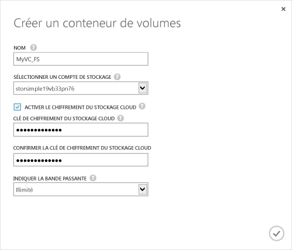

<!--author=SharS last changed: 9/17/15-->

#### Pour créer un conteneur de volumes

1. Sur la page **Démarrage rapide** de l’appareil, cliquez sur **Ajouter un conteneur de volume**. La boîte de dialogue **Créer un conteneur de volume** s’affiche.

    

2. Dans la boîte de dialogue **Créer un conteneur de volume** :
  1. Saisissez un **Nom** pour votre conteneur de volume. Le nom doit contenir de 3 à 32 caractères.
  2. Sélectionnez un **Compte de stockage** à associer à ce conteneur de volume. Vous pouvez choisir le compte par défaut qui est généré au moment de la création du service. Vous pouvez également utiliser l’option **Ajouter nouveau** pour spécifier un compte de stockage qui n’est pas lié à cet abonnement au service.
  3. Sélectionnez **Activer le chiffrement de stockage cloud** pour activer le chiffrement des données envoyées à partir de l’appareil vers le cloud.
  4. Indiquez et confirmez une **Clé de chiffrement de stockage cloud** contenant de 8 à 32 caractères. Cette clé est utilisée par l’appareil pour accéder aux données chiffrées.
  5. Sélectionnez **Illimitée** dans la liste déroulante **Spécifier la bande passante** si vous souhaitez consommer toute la bande passante disponible. Vous pouvez également définir cette option sur **Personnalisé** pour utiliser les contrôles de bande passante et spécifier une valeur comprise entre 1 et 1 000 Mbits/s. Si vos informations d’utilisation de la bande passante sont disponibles, vous pouvez allouer de la bande passante selon une planification en spécifiant **Sélectionner un modèle de bande passante**. Pour une procédure pas à pas, consultez la page [Ajouter un modèle de bande passante](storsimple-manage-bandwidth-templates.md#add-a-bandwidth-template).
  6. Cliquez sur l’icône en forme de coche  pour enregistrer ce conteneur de volume et quitter l’Assistant. 

  Le nouveau conteneur de volumes apparaît sur la page **Conteneurs de volume**.

 **Vidéo disponible**

Pour visionner une vidéo qui montre comment créer un conteneur de volumes dans votre solution StorSimple, cliquez [ici](http://azure.microsoft.com/documentation/videos/create-a-volume-container-in-your-storsimple-solution/).

<!---HONumber=Oct15_HO3-->