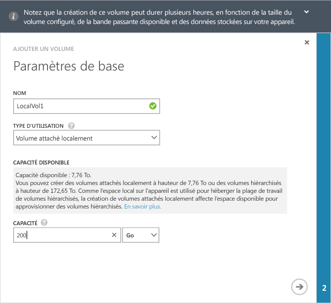
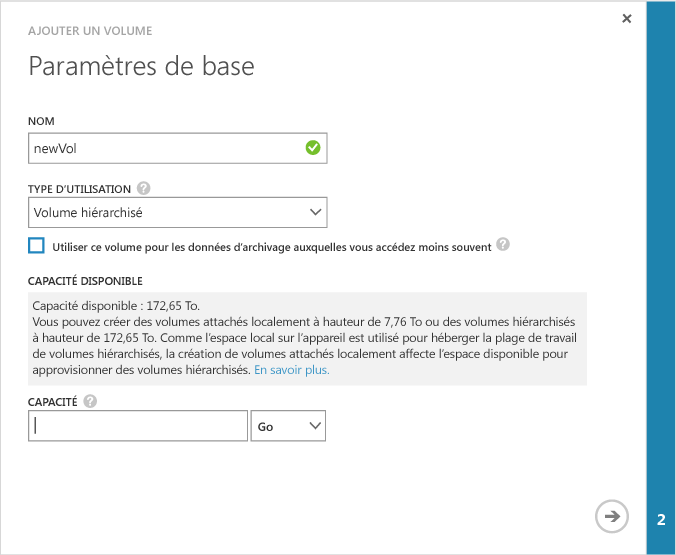
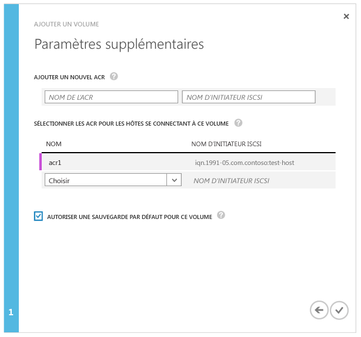

<!--author=alkohli last changed: 08/16/2016-->

#### Pour créer un volume

1. Sur la page **Démarrage rapide** de l’appareil, cliquez sur **Ajouter un volume** pour démarrer l’Assistant Ajouter un volume.

2. Dans l’Assistant Ajouter un volume, sous **Paramètres de base** :

	4. Saisissez un **nom** pour le volume.
	5. Dans la liste déroulante, sélectionnez le **Type d’utilisation** pour le volume. Pour les charges de travail qui nécessitent des garanties locales, une faible latence et les meilleures performances possibles, sélectionnez un volume **épinglé localement**. Pour toutes les autres données, sélectionnez un volume **à plusieurs niveaux**. Si vous utilisez ce volume pour les données d’archivage, cochez la case **Utiliser ce volume pour des données d’archivage moins fréquemment sollicitées**.
	
		La configuration d’un volume épinglé localement est complète, et garantit que les données principales sur le volume sont conservées en local sur l’appareil et ne débordent pas sur le cloud. Si vous créez un volume épinglé localement, l’appareil recherche de l’espace disponible sur les couches locales pour configurer le volume de la taille demandée. L’opération de création d’un volume épinglé localement peut impliquer le débordement des données existantes de l’appareil vers le cloud, et le temps nécessaire pour créer le volume peut être long. La durée totale dépend de la taille du volume configuré, de la bande passante réseau disponible et des données sur votre appareil.

		La configuration d’un volume à plusieurs niveaux est légère, et sa création peut être rapide. La sélection de **Utiliser ce volume pour les données d’archivage moins fréquemment sollicitées** pour le volume à plusieurs niveaux pour les données d’archivage définit la taille de segment de déduplication pour votre volume sur 512 Ko. Si cette option n’est pas activée, le volume à plusieurs niveaux correspondant utilise une taille de segment de 64 Ko. Une grande taille de segment de déduplication permet à l’appareil d’accélérer le transfert des données d’archivage volumineuses vers le cloud.

	3. Indiquez la **capacité allouée** pour votre volume. Prenez en note la capacité disponible en fonction du type de volume sélectionné. La taille de volume spécifiée ne doit pas dépasser la quantité d’espace disponible.

		Vous pouvez configurer des volumes épinglés localement d’une taille maximale de 8,5 To ou des volumes à plusieurs niveaux d’une taille maximale de 200 To sur l’appareil 8100. Sur l’appareil 8600, qui a une plus grande capacité, vous pouvez configurer des volumes épinglés localement d’une taille maximale de 22,5 To ou des volumes à plusieurs niveaux d’une taille maximale de 500 To. Un espace local sur l’appareil étant nécessaire pour héberger la plage de travail des volumes à plusieurs niveaux, la création de volumes épinglés localement a un impact sur l’espace disponible pour la configuration de volumes à plusieurs niveaux. Par conséquent, si vous créez un volume épinglé localement, l’espace disponible pour la création de volumes à plusieurs niveaux sera réduit. De même, si vous créez un volume à plusieurs niveaux, l’espace disponible pour la création de volumes épinglés localement est réduit.

		Si vous configurez un volume épinglé localement de 8,5 To (taille maximale autorisée) sur votre appareil 8100, vous avez utilisé tout l’espace local disponible sur l’appareil. Vous ne pourrez donc pas créer de volume à plusieurs niveaux, puisque l’espace local de l’appareil sera insuffisant pour héberger la plage de travail du volume en question. Les volumes à plusieurs niveaux existants affectent également l’espace disponible. Par exemple, si vous avez un appareil 8100 qui possède déjà des volumes à plusieurs niveaux de 106 To, seuls 4 To d’espace sont disponibles pour les volumes épinglés localement.

        L'illustration suivante montre la boîte de dialogue **Paramètres de base** pour un volume épinglé localement.

         

        L'illustration suivante montre la boîte de dialogue **Paramètres de base** pour un volume à plusieurs niveaux.

         

   4. Cliquez sur l’icône en forme de flèche  pour passer à la page suivante.

3. Dans la boîte de dialogue **Paramètres supplémentaires**, ajoutez un nouvel enregistrement de contrôle d’accès (ACR) :

	1. Saisissez un **Nom** pour votre ACR.
	2. Sous **Nom de l’initiateur iSCSI**, indiquez le nom qualifié iSCSI de votre hôte Windows. Si vous ne possédez pas le nom qualifié, accédez à [Obtenir le nom qualifié d’un hôte Windows Server](#get-the-iqn-of-a-windows-server-host).
	3. Sous **Sauvegarde par défaut pour ce volume ?**, sélectionnez la case à cocher **Activer**. La sauvegarde par défaut crée une stratégie qui s’exécute à 22 h 30 chaque jour (heure de l’appareil) et crée un instantané de cloud de ce volume.
	 
     > [AZURE.NOTE] Une fois la sauvegarde activée ici, elle ne peut pas être annulée. Vous devez modifier le volume pour modifier ce paramètre.

     

4. Cliquez sur l’icône en forme de coche . Un volume est créé avec les paramètres spécifiés.

<!-----HONumber=AcomDC_0914_2016-->