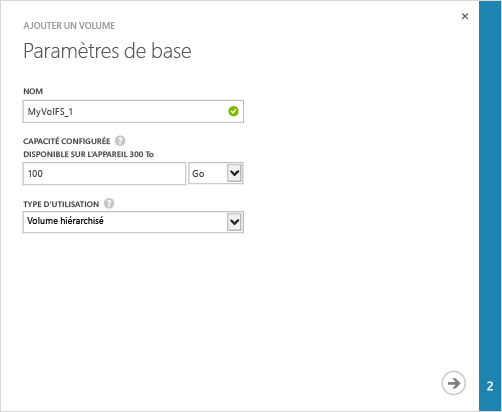
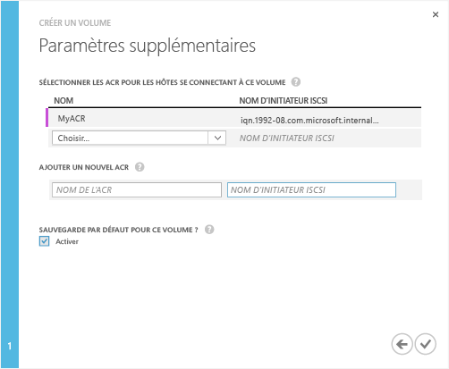

#### Pour créer un volume

1. Sur la page **Démarrage rapide** de l’appareil, cliquez sur **Ajouter un volume**. L’assistant Ajouter un volume se lance.

2. Dans l’Assistant Ajouter un volume, sous **Paramètres de base** :
   1. Saisissez un **nom** pour le volume.
   2. Indiquez la **capacité allouée** pour votre volume. **La capacité du volume doit être comprise entre 1 et 64 To.**
   3. Dans la liste déroulante, sélectionnez le **Type d’utilisation** pour le volume. Pour les données d’archivage moins fréquemment sollicitées, sélectionnez un **Volume d’archive**. Pour tous les autres types de données, sélectionnez **Volume principal**.
   4. Cliquez sur l’icône en forme de flèche  pour passer à la page suivante.

     

3. Dans la boîte de dialogue **Paramètres supplémentaires**, ajoutez un nouvel enregistrement de contrôle d’accès (ACR) :
   1. Saisissez un **Nom** pour votre ACR.
   2. Sous **Nom de l’initiateur iSCSI**, indiquez le nom qualifié iSCSI de votre hôte Windows. Si vous ne possédez pas le nom qualifié, accédez à [Obtenir le nom qualifié d’un hôte Windows Server](#get-the-iqn-of-a-windows-server-host).
   3. Sous **Sauvegarde par défaut pour ce volume ?**, sélectionnez la case à cocher **Activer**. La sauvegarde par défaut crée une stratégie qui s’exécute à 22h30 chaque jour (heure de l’appareil) et crée un instantané de cloud de ce volume.

     >[AZURE.NOTE]Une fois la sauvegarde activée ici, elle ne peut pas être annulée. Vous devez modifier le volume pour modifier ce paramètre.

     

4. Cliquez sur l’icône en forme de coche . Un volume est créé avec les paramètres spécifiés.

<!---HONumber=July15_HO4-->