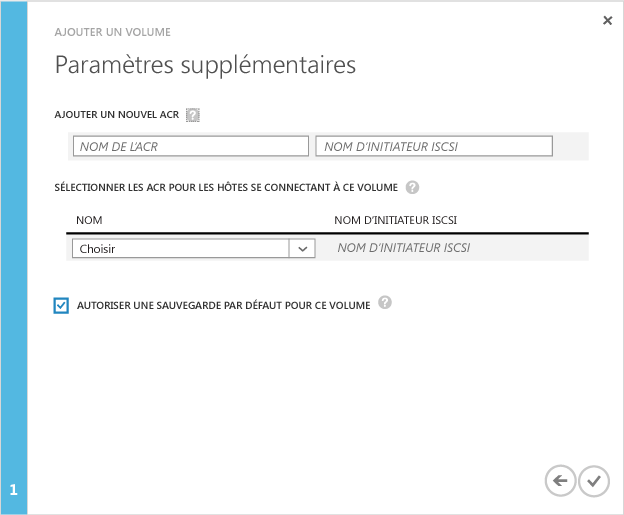

<!--author=SharS last changed: 11/16/15-->

#### Pour créer un volume

1. Sur la page **Démarrage rapide** de l’appareil, cliquez sur **Ajouter un volume**. L’assistant Ajouter un volume se lance.

2. Dans l’Assistant Ajouter un volume, sous **Paramètres de base**, procédez comme suit :
   1. Saisissez un **nom** pour le volume.
   2. Indiquez la **capacité allouée** au volume en Go ou To. La capacité du volume doit être comprise entre 1 Go et 64 To pour un appareil physique.
   3. Dans la liste déroulante, sélectionnez le **Type d’utilisation** pour le volume. 
   4. Si vous utilisez ce volume pour les données d’archivage, cochez la case **Utiliser ce volume pour des données d’archivage moins fréquemment sollicitées**. Dans tous les autres cas, sélectionnez **Volume à plusieurs niveaux**. (Les volumes à plusieurs niveaux étaient appelés volumes principaux).
   4. Cliquez sur l’icône en forme de flèche  pour passer à la page suivante.

        

3. Dans la boîte de dialogue **Paramètres supplémentaires**, ajoutez un nouvel enregistrement de contrôle d’accès (ACR) :
   1. Saisissez un **Nom** pour votre ACR.
   2. Sous **Nom de l’initiateur iSCSI**, indiquez le nom qualifié iSCSI de votre hôte Windows. Si vous ne possédez pas le nom qualifié, accédez à [Obtenir le nom qualifié d’un hôte Windows Server](#get-the-iqn-of-a-windows-server-host).
   3. Nous vous recommandons d’activer la sauvegarde par défaut en cochant la case **Activer une sauvegarde par défaut pour ce volume**. La sauvegarde par défaut crée une stratégie qui s’exécute à 22h30 chaque jour (heure de l’appareil) et crée un instantané de cloud de ce volume.

        > [AZURE.NOTE] After the backup is enabled here, it cannot be reverted. You will need to edit the volume to modify this setting.

        

4. Cliquez sur l’icône en forme de coche . Un volume est créé avec les paramètres spécifiés.

 **Vidéo disponible**

Pour visionner une vidéo qui montre comment créer un volume StorSimple, cliquez [ici](http://azure.microsoft.com/documentation/videos/create-a-storsimple-volume/).

<!---HONumber=AcomDC_1217_2015-->