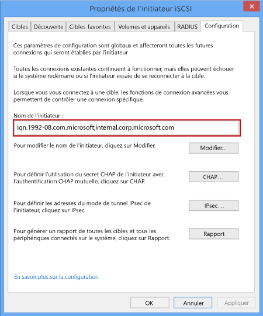

<!--author=SharS last changed: 9/17/15-->

#### Pour obtenir le nom qualifié d’un hôte Windows

1. Démarrez l’initiateur Microsoft iSCSI sur l’hôte Windows. Cliquez sur **Démarrer** > **Outils d’administration** > **Initiateur iSCSI**.

2. Dans la fenêtre **Propriétés de l’initiateur iSCSI**, sous l’onglet **Configuration**, sélectionnez et copiez la chaîne affichée dans le champ **Nom de l’initiateur**.
 
    

3. Enregistrez cette chaîne.

<!---HONumber=AcomDC_0218_2016-->