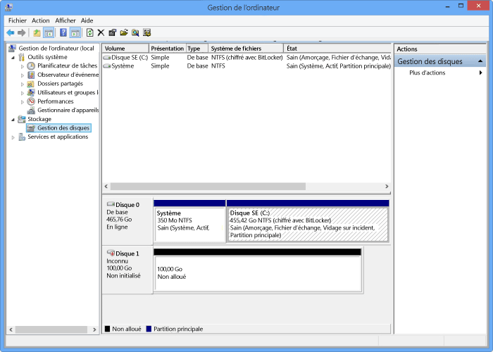

<!--author=SharS last changed: 9/17/15-->

#### Pour monter, initialiser et formater un volume

1. Démarrez l’initiateur Microsoft iSCSI.

2. Dans la fenêtre **Propriétés de l’initiateur iSCSI**, sous l’onglet **Découverte**, cliquez sur **Découvrir un portail**.

3. Dans la boîte de dialogue **Détecter un portail cible**, indiquez l’adresse IP de votre interface réseau compatible iSCSI, puis cliquez sur **OK**.

4. Dans la fenêtre **Propriétés de l’initiateur iSCSI**, sous l’onglet **Cibles**, recherchez les **cibles découvertes**. L’appareil doit apparaître comme **inactif**.

5. Sélectionnez l’appareil cible, puis cliquez sur **Connecter**. Une fois l’appareil connecté, son état doit indiquer **Connecté**. (Pour plus d’informations sur l’utilisation de l’initiateur Microsoft iSCSI, consultez la rubrique [Installation et configuration de l’initiateur Microsoft iSCSI][1].)

6. Sur l’hôte Windows, appuyez sur la touche de logo Windows + X, puis cliquez sur **Exécuter**.

7. Dans la boîte de dialogue **Exécuter**, saisissez **Diskmgmt.msc**. Cliquez sur **OK**. La boîte de dialogue **Gestion des disques** s’affiche. Le volet de droite affiche les volumes de votre ordinateur hôte.

8. Dans la fenêtre **Gestion des disques**, les volumes montés sont affichés comme indiqué dans l’illustration suivante. Cliquez avec le bouton droit sur le volume détecté (cliquez sur le nom du disque), puis cliquez sur **En ligne**.

     

9. Cliquez une nouvelle fois avec le bouton droit sur le volume détecté (cliquez sur le nom du disque), puis cliquez sur **Initialiser**.

10. Pour formater un volume simple, procédez comme suit :
  1. Sélectionnez le volume, cliquez dessus avec le bouton droit (cliquez sur la zone de droite), puis cliquez sur **Nouveau volume simple**.
  2. Dans l’Assistant Nouveau volume simple, spécifiez la lettre de lecteur et la taille du volume et configurez le volume comme système de fichiers NTFS.
  3. Spécifiez une taille d’unité d’allocation 64 Ko. Cette taille d’unité d’allocation fonctionne bien avec les algorithmes de déduplication utilisés dans la solution StorSimple.
  4. Effectuez un formatage rapide.

 **Vidéo disponible**

Pour visionner une vidéo qui montre comment monter, initialiser et formater un volume StorSimple, cliquez [ici](https://azure.microsoft.com/documentation/videos/mount-initialize-and-format-a-storsimple-volume/).

<!--Link references-->
[1]: https://technet.microsoft.com/library/ee338480(WS.10).aspx

<!---HONumber=AcomDC_0128_2016-->