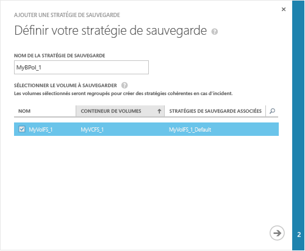
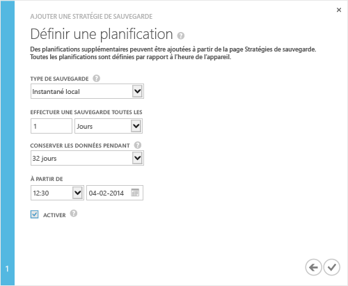

### Pour effectuer une sauvegarde

1. Dans la page **Démarrage rapide**, cliquez sur **Ajouter une stratégie de sauvegarde**. Cette opération permet de démarrer l’Assistant Ajouter une stratégie de sauvegarde. 

2. Dans la page **Définir la stratégie de sauvegarde** :
  1. Spécifiez un nom comprenant entre 3 et 150 caractères pour votre stratégie de sauvegarde.
  2. Sélectionnez les volumes à sauvegarder. Si vous sélectionnez plusieurs volumes, ceux-ci sont regroupés pour créer une sauvegarde afin d’assurer la cohérence des données.
  3. Cliquez sur l’icône en forme de flèche . 
  
    

3. Dans la page **Définir une planification** :
  1. Dans la liste déroulante, sélectionnez le type de sauvegarde. Pour une restauration pour rapide, sélectionnez **Instantané local**. Pour la résilience des données, sélectionnez **Instantané cloud**.
  2. Spécifiez la fréquence de sauvegarde en minutes, heures, jours ou semaines.
  3. Sélectionnez une durée de conservation. La durée de conservation dépend de la fréquence de sauvegarde. Par exemple, si vous sélectionnez une stratégie quotidienne, vous pouvez spécifier une durée de conservation en semaines, alors que pour une stratégie mensuelle, la durée de conservation est en mois.
  4. Sélectionnez l’heure et la date de début de la stratégie de sauvegarde.
  5. Cochez la case **Activer** pour activer la stratégie de sauvegarde. 
  6. Cliquez sur l’icône en forme de coche  pour enregistrer la stratégie.

    
 
     Vous disposez maintenant d’une stratégie de sauvegarde, qui va créer des sauvegardes planifiées des données de volume.

Vous avez terminé la configuration de l’appareil.

<!---HONumber=August15_HO6-->