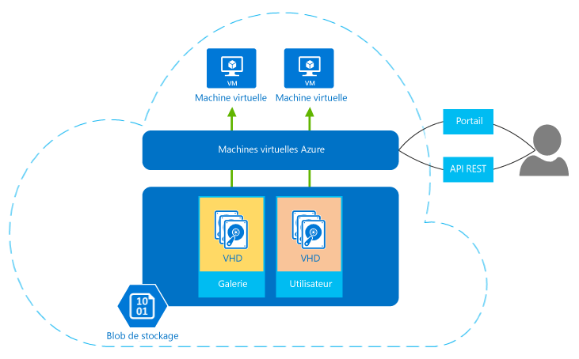

| Options de calcul    |   Public   ciblé |
| ------------------ | --------   |
| [App Service](#tellmeas) | Applications Web évolutives, applications mobiles, applications d’API et applications logiques pour n’importe quel appareil |
| [Cloud Services](#tellmecs)   | Applications cloud à N niveaux, hautement disponibles et évolutives avec plus de contrôle du système d'exploitation |
| [Virtual Machines](#tellmevm) | Machines virtuelles Windows et Linux personnalisées avec contrôle total du système d'exploitation |

## En savoir plus sur Virtual Machines

Azure Virtual Machines vous permet de créer et d’utiliser des machines virtuelles dans le cloud. La technologie de machine virtuelle, qui fournit l'*infrastructure en tant que service*, communément appelée Iaas (Infrastructure as a Service), peut être employée de différentes manières. Voici quelques exemples :

- **Machines virtuelles pour le développement et les tests.** Les groupes de développement utilisent généralement des machines virtuelles, car elles permettent de créer rapidement et facilement un ordinateur avec des configurations spécifiques requises pour encoder et tester une application. Azure Virtual Machines fournit un moyen simple et économique pour créer ces machines virtuelles, les utiliser, puis les supprimer lorsqu'elles ne servent plus.
- **Exécution d'applications dans le cloud.** Pour certaines applications, l'exécution sur le cloud public peut s'avérer intéressante sur le plan économique. Un exemple est une application qui a des pics de demande particulièrement importants . Bien que vous puissiez équiper votre propre centre de données avec suffisamment de matériel pour gérer l’importante demande, ce matériel peut être sous-utilisé la plupart du temps. L'exécution de cette application sur Azure vous permet de payer uniquement pour les machines virtuelles supplémentaires requises, en les arrêtant lorsque vous n’en avez plus besoin. Ou prenons une start-up qui a besoin de ressources informatiques à la demande rapidement et sans engagement : dans ce cas également, Azure peut être le bon choix.
- **Extension de votre centre de données dans le cloud public.** Lorsque vous utilisez Azure Virtual Network, votre organisation peut créer un réseau virtuel (VNET), qui fait partie de votre réseau local, et ajouter des machines virtuelles à ce réseau virtuel. Ceci permet d'exécuter des applications telles que [SharePoint](virtual-machines-sharepoint-infrastructure-services.md) et [SQL Server](virtual-machines-sql-server-infrastructure-services.md) sur une machine virtuelle Azure. Cette approche peut être plus facile à déployer ou moins coûteuse que leur exécution dans des machines virtuelles de votre centre de données.   
- **Récupération d'urgence.** Plutôt que de payer continuellement pour un centre de données de sauvegarde rarement utilisé, la récupération d'urgence basée sur IaaS vous permet de payer pour les ressources informatiques dont vous avez besoin, uniquement lorsque vous en avez besoin. Par exemple, si votre centre de données principal tombe en panne, vous pouvez créer des machines virtuelles qui s'exécutent sur Azure pour les applications essentielles, puis les arrêter lorsque vous n'en avez plus besoin.

Comme d’autres machines virtuelles, une machine virtuelle dans Azure dispose d’un système d'exploitation, de fonctionnalités de stockage et de mise en réseau et peut exécuter un grand nombre d'applications. Vous pouvez utiliser une image fournie par Azure ou l’un de ses partenaires, ou en utiliser une que vous possédez déjà. Inclut par exemple diverses versions, éditions et configurations des produits suivants :
 
-	Windows Server 
-	Serveurs Linux, tels que Suse, Ubuntu et CentOS
-	SQL Server
-	BizTalk Server 
-	SharePoint Server

Les machines virtuelles utilisent des disques durs virtuels pour stocker leurs données et leur système d’exploitation (SE). Les disques durs virtuels sont également utilisés pour les images à partir desquelles vous pouvez choisir d'installer un système d'exploitation. La figure suivante illustre ce concept, ainsi que deux des outils vous permettant de créer et de gérer vos machines virtuelles.

**Figure : Azure Virtual Machines fournit une infrastructure IaaS.**

Les machines virtuelles peuvent être gérées à l'aide d'un portail basé sur navigateur, d’outils de ligne de commande avec prise en charge du script ou directement via l'API REST. Les partenaires de Microsoft tels que RightScale et ScaleXtreme fournissent eux aussi des services de gestion qui s'appuient sur l'API REST.

Outre le système d'exploitation, les autres choix de configuration de vos machines virtuelles incluent  :

- La taille, qui détermine des facteurs tels que le nombre de disques que vous pouvez associer et la puissance de traitement. Azure propose différentes tailles vous permettant de prendre en charge de nombreux types d'utilisation. Pour en savoir plus, consultez la rubrique [Tailles de machines virtuelles](virtual-machines-size-specs.md).  
- La région Azure dans laquelle votre nouvelle machine virtuelle sera hébergée, telle que les États-Unis, l’Europe ou bien l’Asie. 
- Des extensions de machine virtuelle, qui offrent des fonctionnalités supplémentaires à votre machine virtuelle, telles que l’exécution d’antivirus ou l’utilisation de fonctionnalités de configuration d’état souhaité de Windows PowerShell.

D’autres avantages à prendre en compte pour les machines virtuelles :

**Paiement à l'utilisation** : Azure facture un tarif à l’heure, établi en fonction de la taille de la machine virtuelle et du système d'exploitation utilisé. Pour les heures partielles, Azure vous facture uniquement les minutes d'utilisation. Le stockage est facturé séparément. Pour en savoir plus, consultez la rubrique [Tarification des machines virtuelles](http://azure.microsoft.com/pricing/details/virtual-machines/).

**Résilience** : Azure analyse le matériel physique qui héberge chaque machine virtuelle en cours d'exécution. Si un serveur physique exécutant une machine virtuelle échoue, Azure s’en aperçoit, transfère la machine virtuelle vers un nouveau matériel et la redémarre. Ce processus est parfois appelé service de réparation. Azure protège également les données d'une machine virtuelle, en conservant des copies redondantes des disques durs virtuels dans le stockage d’objets blob.

<!----------HONumber=August15_HO6-->