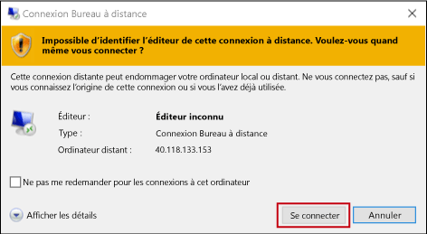
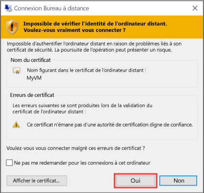

1. Un clic sur **Connecter** permet de créer et de télécharger un fichier de protocole Remote Desktop Protocol (fichier .rdp). Cliquez sur **Ouvrir** pour utiliser ce fichier.
2. Un message vous avertit que le fichier .rdp provient d’un éditeur inconnu. C’est normal. Dans la fenêtre Bureau à distance, cliquez sur **Connecter** pour continuer.
   
    
3. Dans la fenêtre **Sécurité de Windows**, tapez les informations d’identification d’un compte sur la machine virtuelle, puis cliquez sur **OK**.
   
     **Compte local** : il s’agit généralement du nom d’utilisateur et du mot de passe du compte local que vous avez spécifiés quand vous avez créé la machine virtuelle. Le domaine correspond alors au nom de la machine virtuelle et vous devez l’entrer sous la forme *nom_machine_virtuelle*&#92;*nom_utilisateur*.  
   
    **Machine virtuelle jointe à un domaine** : si la machine virtuelle appartient à un domaine, entrez le nom d’utilisateur au format *Domaine*&#92;*Nom d’utilisateur*. Le compte doit également être membre du groupe Administrateurs ou bénéficier de privilèges d’accès à distance à la machine virtuelle.
   
    **Contrôleur de domaine** : si la machine virtuelle est un contrôleur de domaine, tapez le nom d’utilisateur et le mot de passe d’un compte d’administrateur de domaine pour ce domaine.
4. Cliquez sur **Oui** pour vérifier l’identité de la machine virtuelle et terminer la connexion.
   
   

<!--HONumber=Jan17_HO3-->

