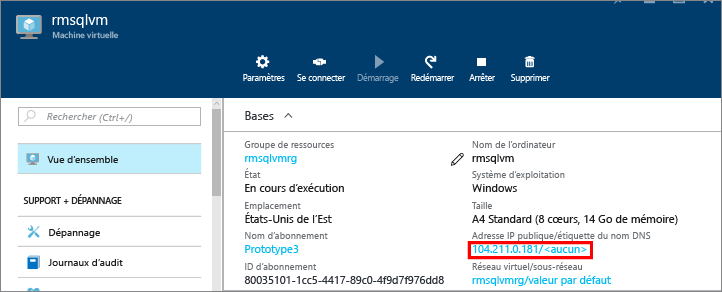
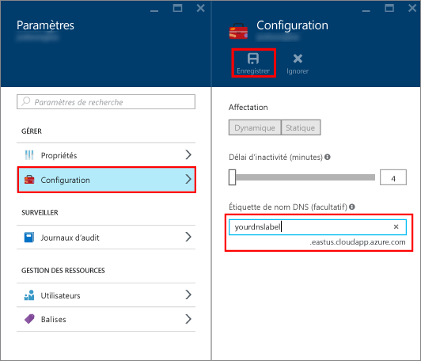
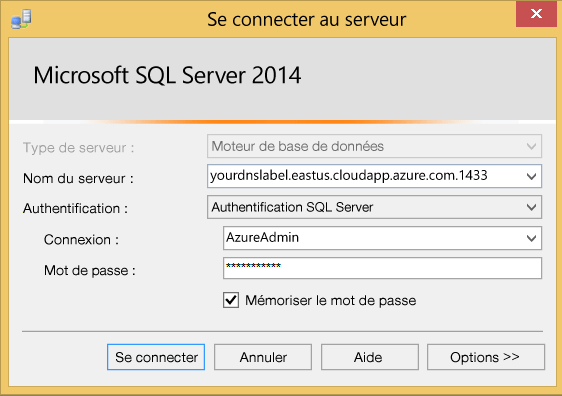

### Configurer un nom DNS pour l’adresse IP publique

Pour vous connecter au moteur de base de données SQL Server à partir d’Internet, tout d’abord, configurez un nom DNS pour votre adresse IP publique.

> [AZURE.NOTE] Les noms DNS ne sont pas nécessaires si vous prévoyez uniquement de vous connecter à l’instance SQL Server dans le même réseau virtuel ou localement.

Pour créer un nom DNS, sélectionnez tout d’abord **Machines virtuelles** dans le portail. Sélectionnez votre machine virtuelle SQL Server pour afficher ses propriétés.

1. Dans le panneau de la machine virtuelle, sélectionnez votre **adresse IP publique.**

	

2. Dans les propriétés de votre adresse IP publique, développez **Configuration**.

3. Entrez un nom DNS. Il s’agit d’un enregistrement A qui peut être utilisé pour la connexion à votre machine virtuelle SQL Server par nom plutôt que directement par l’adresse IP.

4. Cliquez sur le bouton **Enregistrer**.

	

### Connexion au moteur de base de données à partir d'un autre ordinateur

1. Sur un ordinateur connecté à Internet, ouvrez SQL Server Management Studio (SSMS).

2. Dans la boîte de dialogue **Se connecter au serveur** ou **Se connecter au moteur de base de données**, modifiez la valeur **Nom du serveur**. Entrez le nom DNS complet de la machine virtuelle (déterminé lors de la tâche précédente).

3. Dans la zone **Authentification**, sélectionnez **Authentification SQL Server**.

5. Dans la zone **Connexion**, saisissez le nom d’une connexion SQL valide.

6. Dans la zone **Mot de passe**, saisissez le mot de passe de la connexion.

7. Cliquez sur **Connecter**.

	

<!---HONumber=AcomDC_0629_2016-->