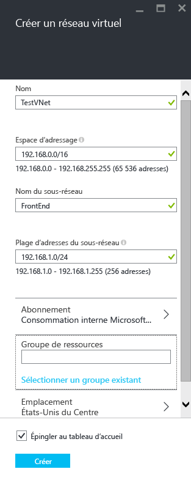
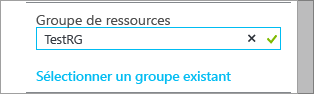
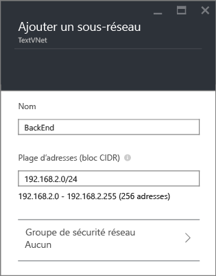
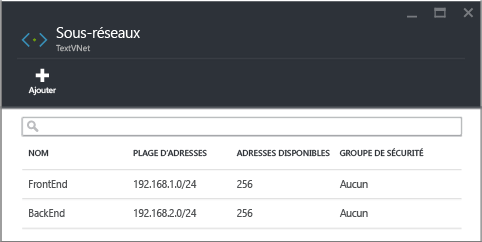

## Création d’un réseau virtuel dans le portail Azure
Pour créer un réseau virtuel selon le scénario ci-dessus à l’aide du portail Azure en version préliminaire, suivez les étapes ci-dessous.

1. Dans un navigateur, accédez à http://portal.azure.com et, si nécessaire, connectez-vous avec votre compte Azure.
2. Cliquez sur **NOUVEAU** > **Réseau** > **Réseau virtuel**, cliquez sur **Resource Manager** dans la liste **Sélectionner un modèle de déploiement**, puis cliquez sur **Créer**, comme illustré dans la figure ci-dessous.
   
    
3. Dans le panneau **Créer un réseau virtuel** , configurez les paramètres du réseau virtuel, comme illustré dans la figure ci-dessous.
   
    
4. Cliquez sur **Groupe de ressources** et sélectionnez un groupe de ressources auquel ajouter le réseau virtuel ou cliquez sur **Créer** pour ajouter le réseau virtuel à un groupe de ressources. La figure ci-dessous illustre les paramètres du nouveau groupe de ressources **TestRG**. Pour plus d’informations sur les groupes de ressources, consultez [Présentation d’Azure Resource Manager](../articles/azure-resource-manager/resource-group-overview.md#resource-groups).
   
    
5. Si nécessaire, modifiez les paramètres **Abonnement** et **Emplacement** de votre réseau virtuel. 
6. Si vous ne souhaitez pas voir le réseau virtuel sous forme de mosaïque dans le **Tableau d’accueil**, désactivez **Épingler au tableau d’accueil**. 
7. Cliquez sur **Créer** et notez la mosaïque **Création du réseau virtuel**, comme indiqué dans la figure ci-dessous.
   
    
8. Attendez que le réseau virtuel soit créé, puis dans le panneau **Réseau virtuel**, cliquez sur **Tous les paramètres** > **Sous-réseaux** > **Ajouter**, comme indiqué ci-dessous.
   
    
9. Spécifiez les paramètres de sous-réseau pour le sous-réseau *BackEnd* comme illustré ci-dessous, puis cliquez sur **OK**. 
   
    
10. Notez la liste des sous-réseaux, comme indiqué dans la figure ci-dessous.
    
    

<!---HONumber=Nov16_HO2-->

