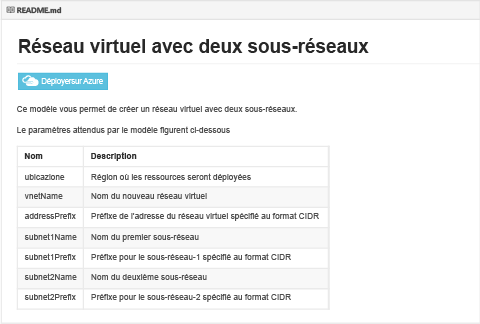
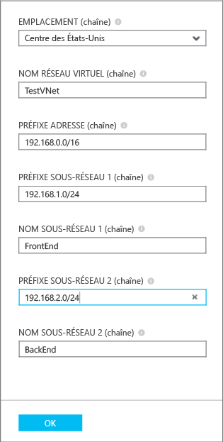
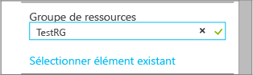
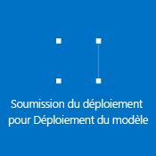

## Déployer le modèle ARM en cliquant pour déployer

Vous pouvez réutiliser les modèles ARM prédéfinis sur le référentiel GitHub géré par Microsoft et ouvert à la communauté. Ces modèles peuvent être déployés directement depuis GitHub ou téléchargés et modifiés selon vos besoins. Pour déployer un modèle qui crée un réseau virtuel avec deux sous-réseaux, suivez les étapes ci-dessous.

1. Dans un navigateur, accédez à [https://github.com/Azure/azure-quickstart-templates](https://github.com/Azure/azure-quickstart-templates).
2. Parcourez la liste des modèles, puis cliquez sur **101-vnet-two-subnets**. Consultez le fichier **README.md**, comme illustré ci-dessous.

	

3. Cliquez sur **Déployer dans Azure**. Si nécessaire, entrez vos informations d’identification Azure.
4. Dans le panneau **Paramètres**, entrez les valeurs que vous souhaitez utiliser pour créer votre réseau virtuel, puis cliquez sur **OK**. La figure ci-dessous illustre les valeurs de ce scénario.

	

4. Cliquez sur **Groupe de ressources** et sélectionnez un groupe de ressources auquel ajouter le réseau virtuel ou cliquez sur **Créer** pour ajouter le réseau virtuel à un groupe de ressources. La figure ci-dessous illustre les paramètres du nouveau groupe de ressources **TestRG**.

	

5. Si nécessaire, modifiez les paramètres **Abonnement** et **Emplacement** de votre réseau virtuel.
6. Si vous ne souhaitez pas voir le réseau virtuel sous forme de mosaïque dans le **Tableau d’accueil**, désactivez **Épingler au tableau d’accueil**.
5. Cliquez sur **Conditions juridiques**, lisez les termes du contrat, puis cliquez sur **Acheter** si vous êtes d’accord. 
6. Cliquez sur **Créer** pour créer le réseau virtuel.

	

7. Une fois le déploiement terminé, cliquez sur **TestVNet** > **Tous les paramètres** > **Sous-réseaux** pour afficher les propriétés du sous-réseau, comme illustré ci-dessous.

	

<!---HONumber=AcomDC_0323_2016-->