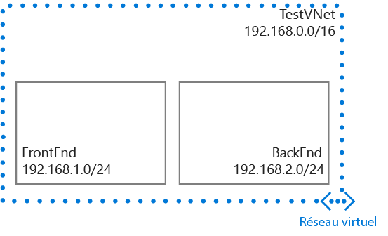

## Scénario
Pour mieux illustrer comment créer un réseau virtuel et des sous-réseaux, ce document utilisera le scénario ci-dessous.

Dans ce scénario, vous allez créer un réseau virtuel nommé **TestVNet** avec un bloc CIDR réservé de **192.168.0.0./16**. Votre réseau virtuel contient les sous-réseaux suivants : 

* **FrontEnd**, qui utilise **192.168.1.0/24** comme bloc CIDR.
* **BackEnd**, qui utilise **192.168.2.0/24** comme bloc CIDR.

<!--HONumber=Nov16_HO2-->

