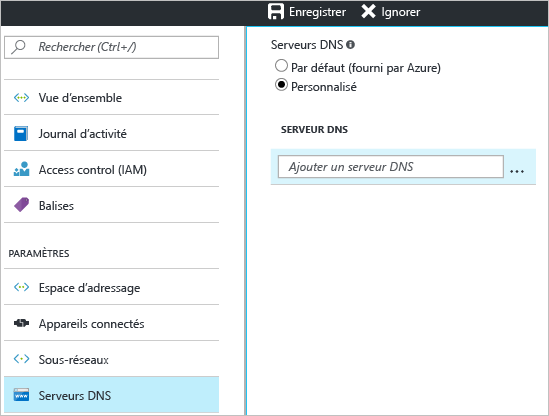

1. Sur la page **Paramètres** de votre réseau virtuel, accédez à la section **Serveurs DNS** et cliquez dessus pour ouvrir le panneau correspondant.
2. Sur la page **Serveurs DNS**, sous **Serveurs DNS**, sélectionnez **Personnalisé**.
3. Dans le champ **Serveur DNS principal**, dans la zone **Ajouter un serveur DNS**, entrez l'adresse IP du serveur DNS que vous souhaitez utiliser pour la résolution de nom. Lorsque vous avez terminé d’ajouter des serveurs DNS, cliquez sur **Enregistrer** en haut du panneau, pour enregistrer votre configuration.
   
    

