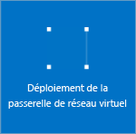

1. Dans le portail, accédez à **Nouveau**, puis sélectionnez **Mise en réseau**. Sélectionnez **Passerelle de réseau virtuel** dans la liste.

	

2. Dans le panneau **Créer une passerelle réseau virtuel**, attribuez un nom à votre passerelle dans le champ **Nom**. Cela ne revient pas au même que de nommer un sous-réseau de passerelle. Il s’agit du nom de l’objet de passerelle.
 
3. Choisissez ensuite le réseau virtuel sur lequel vous souhaitez déployer cette passerelle. Cliquez sur la flèche pour ouvrir le panneau **Choisir un réseau virtuel**, puis cliquez sur le réseau virtuel. Pour que le réseau virtuel apparaisse dans la liste, il doit déjà comporter un sous-réseau de passerelle valide.

4. Définissez une adresse IP publique. Cliquez sur la flèche pour ouvrir le panneau **Choisir une adresse IP publique**. Cliquez ensuite sur **Créer** pour ouvrir le panneau **Créer une adresse IP publique**. Donnez à un nom à votre adresse IP publique. Notez qu’il ne vous est pas demandé d’entrer une adresse IP, celle-ci étant affectée dynamiquement. Vous devez plutôt entrer le nom de l’objet d’adresse IP auquel l’adresse sera affectée. Cliquez sur **OK** pour enregistrer vos modifications.

5. Dans **Type de passerelle**, sélectionnez le type de passerelle spécifié pour votre configuration.

6. Dans **Type de réseau privé virtuel**, sélectionnez le type de VPN spécifié pour votre configuration.

7. Dans **Abonnement**, vérifiez que l’abonnement approprié est sélectionné.

8. Pour le champ **Groupe de ressources**, le groupe de ressources est déterminé par le réseau virtuel que vous sélectionnez.

9. Dans **Emplacement**, vérifiez que l’emplacement dans lequel se trouvent votre groupe de ressources et votre réseau virtuel est indiqué.

10. Vous pouvez sélectionner **Épingler au tableau de bord** si vous souhaitez que votre passerelle apparaisse sur le tableau de bord. Cliquez sur **Créer** pour créer la passerelle. La vignette « Déploiement d’une passerelle de réseau virtuel » s’affiche dans le tableau de bord. La création d’une passerelle peut prendre jusqu’à 45 minutes car de nombreuses opérations sont réalisées en arrière-plan. Vous devrez peut-être actualiser la page du portail pour que l’état terminé apparaisse.

	
	

11. Une fois la passerelle créée, examinez le réseau virtuel dans le portail pour obtenir l’adresse IP affectée à la passerelle. Cette dernière apparaît comme un appareil connecté. Vous pouvez cliquer sur le périphérique connecté (votre passerelle de réseau virtuel) pour afficher davantage d’informations.

