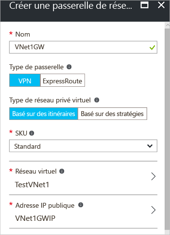

1. Sur le côté gauche de la page du portail, cliquez sur **+** et tapez « Passerelle de réseau virtuel » dans la barre de recherche. Dans **Résultats**, recherchez et cliquez sur **Passerelle de réseau virtuel**. En bas du panneau **Passerelle de réseau virtuel**, cliquez sur **Créer**. Cette opération ouvre le panneau **Créer une passerelle de réseau virtuel**.
2. Dans le panneau **Créer une passerelle réseau virtuel**, renseignez les valeurs pour votre passerelle de réseau virtuel.

    
3. **Nom** : nommez votre passerelle. Cela ne revient pas au même que de nommer un sous-réseau de passerelle. Il s’agit du nom de l’objet de passerelle que vous créez.
4. **Type de passerelle** : sélectionnez **VPN**. Les passerelles VPN utilisent le type de passerelle de réseau virtuel **VPN**. 
5. Dans **Type de réseau privé virtuel** : sélectionnez le type de VPN spécifié pour votre configuration. La plupart des configurations requièrent un type de VPN basé sur un itinéraire.
6. **Référence** : sélectionnez la référence de passerelle dans la liste déroulante. Les références répertoriées dans la liste déroulante dépendent du type de VPN que vous sélectionnez.
7. **Emplacement** : vous devrez peut-être faire défiler pour afficher l’emplacement. Renseignez le champ **Emplacement** de manière à ce qu’il pointe vers l’emplacement où se trouve votre réseau virtuel. Si l’emplacement ne pointe pas vers la région où se trouve votre réseau virtuel, le réseau virtuel n’apparaîtra pas dans la liste déroulante « Choisir un réseau virtuel » de l’étape suivante.
8. **Réseau virtuel** : choisissez le réseau virtuel auquel vous souhaitez ajouter cette passerelle. Cliquez sur **Réseau virtuel** pour ouvrir le panneau **Choisir un réseau virtuel**. Sélectionnez le réseau virtuel. Si vous ne voyez pas votre réseau virtuel, assurez-vous que le champ **Emplacement** pointe sur la région dans laquelle se trouve votre réseau virtuel.
9. **Adresse IP publique** : ce panneau crée un objet d’adresse IP publique auquel une adresse IP publique sera être affectée dynamiquement. Cliquez sur **l’adresse IP publique** pour ouvrir le panneau **Choisir une adresse IP publique**. Cliquez sur **Créer** pour ouvrir le panneau **Créer une adresse IP publique**. Donnez à un nom à votre adresse IP publique. Cliquez sur **OK** pour enregistrer vos modifications à ce panneau.

    
10. **Abonnement** : vérifiez que l’abonnement approprié est sélectionné.
11. **Groupe de ressources** : ce paramètre est déterminé par le réseau virtuel que vous sélectionnez. 
12. Ne changez pas **l’emplacement** après avoir spécifié les paramètres ci-dessus.
13. Vérifiez les paramètres. Vous pouvez sélectionner **Épingler au tableau de bord** en bas du panneau si vous souhaitez que votre passerelle apparaisse sur le tableau de bord.
14. Cliquez sur **Créer** pour créer la passerelle. Les paramètres sont alors validés et la vignette « Déploiement d’une passerelle de réseau virtuel » s’affiche sur le tableau de bord. La création d’une passerelle peut prendre jusqu’à 45 minutes Vous devrez peut-être actualiser la page du portail pour que l’état terminé apparaisse.
    
    
15. Une fois la passerelle créée, examinez le réseau virtuel dans le portail pour obtenir l’adresse IP affectée à la passerelle. Cette dernière apparaît comme un appareil connecté. Vous pouvez cliquer sur l’appareil connecté (votre passerelle de réseau virtuel) pour afficher davantage d’informations.