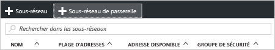
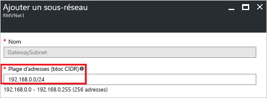

1. Dans le [portail](http://portal.azure.com), accédez au réseau virtuel Resource Manager pour lequel vous souhaitez créer une passerelle de réseau virtuel.
2. Dans la section**Paramètres** du panneau de votre réseau virtuel, cliquez sur **Sous-réseaux** pour développer le panneau Sous-réseaux.
3. Dans le panneau **Sous-réseaux**, cliquez sur **+Sous-réseau de passerelle** pour ouvrir le panneau **Ajouter un sous-réseau**. 
   
    
4. Le **Nom** de votre sous-réseau est automatiquement rempli avec la valeur « GatewaySubnet ». Cette valeur est nécessaire pour qu’Azure puisse reconnaître le sous-réseau en tant que sous-réseau de passerelle. Ajustez les valeurs de **plage d’adresses** renseignées automatiquement pour qu’elles correspondent à la configuration requise.

    
5. Pour créer le sous-réseau, cliquez sur **OK** en bas du panneau.

