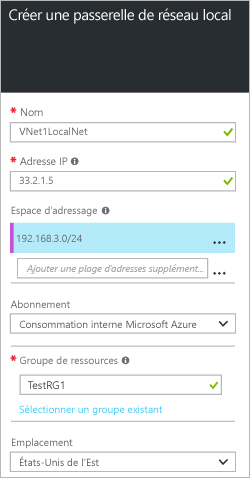

1. Dans le portail Azure, accédez à **Nouveau** > **Mise en réseau** > **Passerelle de réseau local**.

	

2. Dans le panneau **Créer une passerelle de réseau local**, spécifiez un **Nom** pour votre objet Passerelle de réseau local.
 
3. Spécifiez une **adresse IP** publique valide pour le périphérique VPN ou la passerelle de réseau virtuel auquel vous souhaitez vous connecter. Si ce réseau local représente un emplacement local, il s’agit de l’adresse IP publique du périphérique VPN auquel vous souhaitez vous connecter. Il ne peut pas se trouver derrière NAT et doit être accessible par Azure. Si ce réseau local représente un autre réseau virtuel, spécifiez l’adresse IP publique qui a été affectée à la passerelle de réseau virtuel pour ce réseau virtuel. 

4. **Espace d’adressage** fait référence aux plages d’adresses du réseau qui représente ce réseau local. Vous pouvez ajouter plusieurs plages d’espaces d’adressage. Assurez-vous que les plages que vous spécifiez ici ne se chevauchent pas avec les plages d’autres réseaux auxquels vous souhaitez vous connecter.
 
5. Pour **Abonnement**, vérifiez que l’abonnement approprié s’affiche.

6. Pour **Groupe de ressources**, sélectionnez le groupe de ressources que vous souhaitez utiliser. Vous pouvez créer un groupe de ressources ou en sélectionner un déjà créé.

7. Dans**Emplacement**, sélectionnez l’emplacement dans lequel cet objet sera créé. Vous pouvez sélectionner l’emplacement dans lequel se trouve votre réseau virtuel, mais vous n’êtes pas obligé de le faire.

8. Cliquez sur **Créer** pour créer la passerelle de réseau local.

<!-------HONumber=AcomDC_0810_2016-->