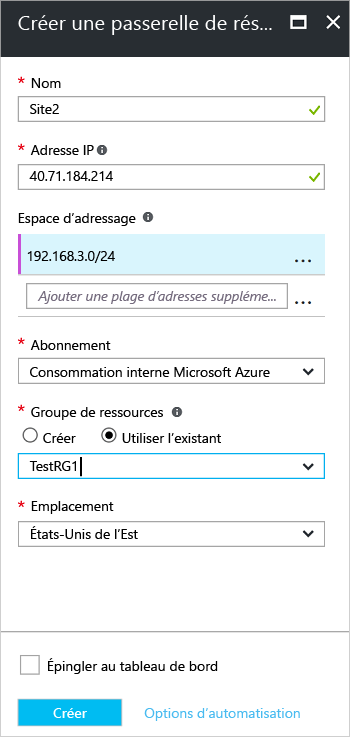

1. Dans le portail, à partir de **Toutes les ressources**, cliquez sur **+ Ajouter**. Dans la zone de recherche du panneau **Tout**, tapez **passerelle de réseau local**, puis cliquez sur Rechercher. Cette commande retourne une liste. Cliquez sur **Passerelle de réseau Local** pour ouvrir le panneau, puis cliquez sur **Créer** pour ouvrir le panneau **Créer une passerelle réseau local**.

      
2. Dans le panneau **Créer une passerelle de réseau local**, spécifiez un **Nom** pour votre objet Passerelle de réseau local.
3. Spécifiez une **adresse IP** publique valide pour la passerelle de réseau virtuel ou le périphérique VPN auquel vous souhaitez vous connecter. Il s’agit de l’adresse IP publique du périphérique VPN auquel vous souhaitez vous connecter. Il ne peut pas se trouver derrière NAT et doit être accessible par Azure. *Utilisez vos propres valeurs, pas les valeurs indiquées dans la capture d’écran*.
4. **Espace d’adressage** fait référence aux plages d’adresses du réseau qui représente ce réseau local. Vous pouvez ajouter plusieurs plages d’espaces d’adressage. Assurez-vous que les plages que vous spécifiez ici ne se chevauchent pas avec les plages d’autres réseaux auxquels vous souhaitez vous connecter. Azure achemine la plage d’adresses que vous spécifiez vers l’adresse IP du périphérique VPN local. *Utilisez vos propres valeurs ici, pas les valeurs indiquées dans la capture d’écran*.
5. Pour **Abonnement**, vérifiez que l’abonnement approprié s’affiche.
6. Pour **Groupe de ressources**, sélectionnez le groupe de ressources que vous souhaitez utiliser. Vous pouvez créer un groupe de ressources ou en sélectionner un déjà créé.
7. Dans **Emplacement**, sélectionnez l’emplacement dans lequel cet objet sera créé. Vous pouvez sélectionner l’emplacement dans lequel se trouve votre réseau virtuel, mais vous n’êtes pas obligé de le faire.
8. Cliquez sur **Créer** pour créer la passerelle de réseau local.