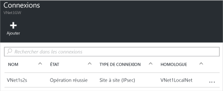

1. Localisez votre passerelle de réseau virtuel et cliquez sur **Tous les paramètres** pour ouvrir le panneau **Paramètres**.

2. Dans le panneau **Paramètres**, cliquez sur **Connexions**, puis sur **Ajouter** en haut du panneau pour ouvrir le panneau **Ajouter une connexion**.

	

3. Dans le panneau **Ajouter une connexion**, donnez un **Nom** à votre connexion.

4. Pour **Type de connexion**, sélectionnez **Site à site (IPSec)**.

5. Pour **Passerelle de réseau virtuel**, la valeur est fixe, car vous vous connectez à partir de cette passerelle.

6. Pour **Passerelle de réseau local**, cliquez sur **Choisir une passerelle de réseau local** et sélectionnez la passerelle de réseau local que vous souhaitez utiliser.

7. Pour **Clé partagée**, la valeur doit correspondre à la valeur que vous utilisez pour votre périphérique VPN local. Si votre périphérique VPN sur votre réseau local ne fournit pas de clé partagée, vous pouvez en créer une, puis la saisir ici et sur votre périphérique local. Il est important que les deux correspondent.

8. Les valeurs restantes pour **Abonnement**, **Groupe de ressources** et **Emplacement** sont fixes.

9. Cliquez sur **OK** pour créer votre connexion. Le message *Création de la connexion* clignotera à l’écran.

10. Une fois la connexion créée, elle apparaît dans le panneau **Connexions** de votre passerelle.

	

<!-----HONumber=AcomDC_0406_2016-->