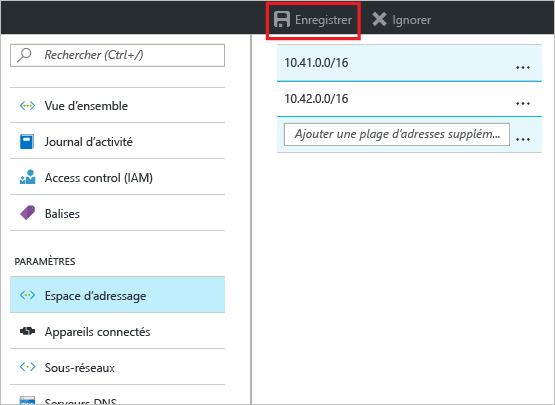
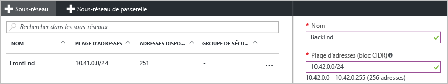

### Pour ajouter un espace d’adressage
1. Pour ajouter un espace d’adressage supplémentaire, sous la section **Paramètres** du panneau de votre réseau virtuel, cliquez sur **Espace d’adressage** pour ouvrir le panneau correspondant.
2. Ajoutez l’espace d’adressage supplémentaire, puis cliquez sur **Enregistrer** en haut du panneau.
   
    

### Pour créer des sous-réseaux
1. Pour créer des sous-réseaux, dans la section **Paramètres** du panneau de votre réseau virtuel, cliquez sur **Sous-réseaux** pour ouvrir le panneau **Sous-réseaux**. 
2. Dans le panneau Sous-réseaux, cliquez sur **+Sous-réseau** pour ouvrir le panneau **Ajouter un sous-réseau**. Nommez votre nouveau sous-réseau et spécifiez la plage d’adresses.
   
            
3. Cliquez sur **OK** en bas du panneau pour enregistrer vos modifications.
   
    

