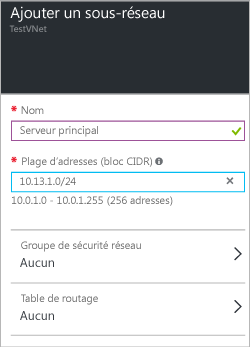

### Pour ajouter un espace d’adressage

1. Pour ajouter un espace d’adressage supplémentaire, cliquez sur **Tous les paramètres** pour ouvrir le panneau **Paramètres**. 

2. Dans le panneau **Paramètres**, cliquez sur **Espace d’adressage** pour ouvrir le panneau Espace d’adressage. Ajoutez l’espace d’adressage supplémentaire dans ce panneau, puis cliquez sur **Enregistrer** en haut du panneau.

	

### Pour ajouter des sous-réseaux 

1. Pour ajouter des sous-réseaux supplémentaires à vos espaces d’adressage, dans le panneau **Paramètres**, cliquez sur **Sous-réseaux** pour ouvrir le panneau **Sous-réseaux**. 

2. Dans le panneau Sous-réseaux, cliquez sur **Ajouter** pour ouvrir le panneau **Ajouter un sous-réseau**. Nommez votre nouveau sous-réseau et spécifiez la plage d’adresses, puis cliquez sur **OK** en bas du panneau. Après avoir créé un sous-réseau, vous pouvez utiliser le panneau Sous-réseaux pour afficher tous vos sous-réseaux pour un réseau virtuel.

	

<!-----HONumber=AcomDC_0406_2016-->