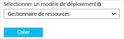

Pour créer un réseau virtuel à l’aide du portail Azure, procédez comme suit. Notez que les captures d’écran sont fournies à titre d’exemple. Assurez-vous de remplacer ces valeurs par les vôtres.

Pour plus d’informations sur l’utilisation des réseaux virtuels, voir [Présentation du réseau virtuel](../articles/virtual-network/virtual-networks-overview.md).

1. Dans un navigateur, accédez au [portail Azure](http://portal.azure.com) et, si nécessaire, connectez-vous avec votre compte Azure.

2. Cliquez sur **Nouveau** **>** **Mise en réseau** **>** **Réseau virtuel**.

	

3. En bas du panneau Réseau virtuel, à partir de la liste **Sélectionner un modèle de déploiement**, choisissez **Resource Manager** puis cliquez sur **Créer**.

	

4. Dans le panneau **Créer un réseau virtuel**, configurez les paramètres du réseau virtuel. Dans ce panneau, vous allez ajouter votre premier espace d’adressage et une plage d’adresses de sous-réseau unique. Après avoir créé le réseau virtuel, vous pouvez revenir en arrière et ajouter des espaces d’adressage et des sous-réseaux supplémentaires. Il s’agit d’une limitation actuelle du portail. Vous pouvez toujours revenir pour mettre à jour ces valeurs en modifiant les propriétés du réseau virtuel dans le portail ou à l’aide de PowerShell. Les valeurs que vous utilisez dépendent de la configuration que vous souhaitez créer. Pensez à vous reporter aux valeurs de configuration planifiée.

	

5. Vérifiez qu’il s’agit de l’**abonnement** approprié. Vous pouvez modifier des abonnements à l’aide de la liste déroulante.

6. Cliquez sur **Groupe de ressources** et sélectionnez un groupe de ressources existant, ou créez un groupe de ressources. Si vous créez un groupe, nommez-le en fonction de vos valeurs de configuration planifiée. Pour plus d’informations sur les groupes de ressources, consultez [Présentation d’Azure Resource Manager](resource-group-overview.md/#resource-groups).

7. Ensuite, sélectionnez les paramètres d’**emplacement** pour votre réseau virtuel. Notez que l’emplacement déterminera où se trouveront les ressources que vous déployez sur ce réseau virtuel. Vous ne pouvez pas le modifier ultérieurement sans avoir à redéployer vos ressources.

8. Sélectionnez **Épingler au tableau de bord** si vous souhaitez être en mesure de trouver votre réseau virtuel facilement sur le tableau de bord, puis cliquez sur **Créer**.
	
	

9. Après avoir cliqué sur Créer, vous verrez une vignette apparaître sur votre tableau de bord. Celle-ci indique la progression de votre réseau virtuel. La vignette change lorsque le réseau virtuel est créé.

	

<!---HONumber=AcomDC_0406_2016-->