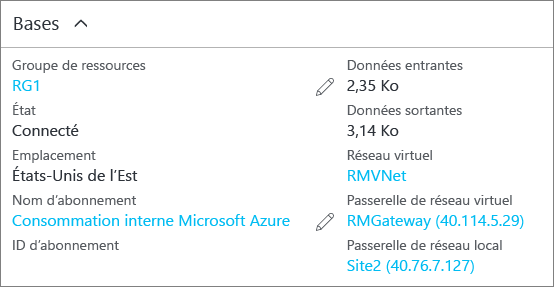

### Vérification de votre connexion à l’aide de PowerShell
Vous pouvez vérifier que votre connexion a réussi à l’aide de l’applet de commande `Get-AzureRmVirtualNetworkGatewayConnection`, avec ou sans `-Debug`. 

1. Utilisez l’exemple d’applet de commande suivant, en configurant les valeurs sur les vôtres. Si vous y êtes invité, sélectionnez A pour exécuter tout. Dans l’exemple, `-Name` fait référence au nom de la connexion que vous avez créé et voulez tester.
   
        Get-AzureRmVirtualNetworkGatewayConnection -Name MyGWConnection -ResourceGroupName MyRG
2. Une fois l’applet de commande exécutée, affichez les valeurs. Dans l’exemple ci-dessous, l’état de la connexion indique « Connecté » et vous pouvez voir les octets d’entrée et de sortie.
   
        Body:
        {
          "name": "MyGWConnection",
          "id":
        "/subscriptions/086cfaa0-0d1d-4b1c-94544-f8e3da2a0c7789/resourceGroups/MyRG/providers/Microsoft.Network/connections/MyGWConnection",
          "properties": {
            "provisioningState": "Succeeded",
            "resourceGuid": "1c484f82-23ec-47e2-8cd8-231107450446b",
            "virtualNetworkGateway1": {
              "id":
        "/subscriptions/086cfaa0-0d1d-4b1c-94544-f8e3da2a0c7789/resourceGroups/MyRG/providers/Microsoft.Network/virtualNetworkGa
        teways/vnetgw1"
            },
            "localNetworkGateway2": {
              "id":
        "/subscriptions/086cfaa0-0d1d-4b1c-94544-f8e3da2a0c7789/resourceGroups/MyRG/providers/Microsoft.Network/localNetworkGate
        ways/LocalSite"
            },
            "connectionType": "IPsec",
            "routingWeight": 10,
            "sharedKey": "abc123",
            "connectionStatus": "Connected",
            "ingressBytesTransferred": 33509044,
            "egressBytesTransferred": 4142431
          }

### Vérification de votre connexion à l’aide du portail Azure
Dans le portail Azure, vous pouvez afficher l’état de la connexion en accédant à cette dernière. Pour ce faire, plusieurs options s’offrent à vous. Les étapes suivantes montrent un moyen d’accéder à votre connexion pour la vérifier.

1. Dans le [portail Azure](http://portal.azure.com), cliquez sur **Toutes les ressources** et accédez à votre passerelle de réseau virtuel.
2. Dans le panneau de votre passerelle de réseau virtuel, cliquez sur **Connexions**. Vous pouvez voir l’état de chaque connexion.
3. Cliquez sur le nom de la connexion que vous souhaitez vérifier pour ouvrir **Essentials**. Dans Essentials, vous pouvez afficher plus d’informations sur la connexion. Ce **champ** indique « Opération réussie » et « Connecté » lorsqu’une connexion a été établie.
   
    

<!--HONumber=Nov16_HO2-->

